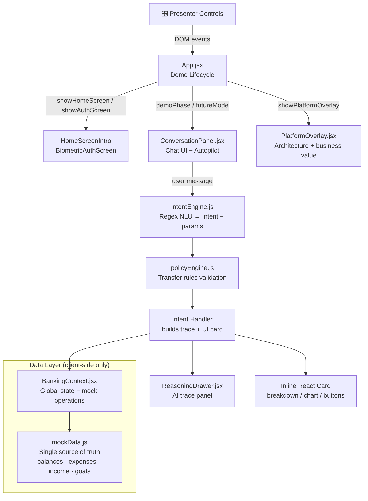

[View Repo :octicons-mark-github-16:](https://github.com/Ready2k/finTechDemo){ .md-button }

# Ambient Banking Assistant — AI-Native Financial Copilot Demo

**TL;DR:** A strategic product demo that shows what banking could feel like in 2028. Natural language replaces app navigation — the AI understands intent, reasons over financial context, applies policy guardrails, and executes safe banking actions. Designed to land with stakeholders in under 3 minutes.

**Stack:** React 19 • Vite • Framer Motion • Client-side only (no backend, no API keys)

---

## ✨ Features

- **📱 Ambient Entry** - iPhone home screen with Apple Intelligence rainbow border; Siri query flows directly into the banking session
- **🔐 Biometric Auth** - Face ID scan animation before the banking app is revealed
- **💬 Natural Language Banking** - Intent engine parses queries like *"Can I afford a £900 holiday?"* into structured actions with full reasoning traces
- **🛡️ Policy Engine** - Transfer rules enforced visually (min balance £1,000; confirmation required above £500); policy outcomes shown inline
- **🧠 Reasoning Drawer** - Expandable AI trace panel showing intent confidence, reasoning steps, financial calculations, and policy outcome — makes it feel like a real AI system, not a UI mock
- **📊 Structured UI Cards** - Every assistant response renders rich inline cards: breakdown tables, animated bar charts, action buttons
- **⚡ 2028 / Future Mode** - Toggle frictionless mode: transfers execute without confirmation, reasoning shows "friction waived" language, continuous biometric session narrative
- **🎛️ Presenter Controls** - Play/pause autopilot, prev/next scene, scene jump, reset, dark/light theme toggle

---

## 🎬 Demo Flow

| Scene | Name | What Happens |
|-------|------|-------------|
| 0 | **Ambient Entry** | iPhone home screen + Apple Intelligence glow; user types query to Siri |
| — | **Biometric Auth** | Face ID animation; in 2028 mode the Siri query passes through automatically |
| 1 | **Financial Awareness** | *"How much money can I spend this month?"* → Monthly breakdown card with Safe-to-Spend figure |
| 2 | **Spending Insight** | *"Where does my money go each month?"* → Category analysis with animated bar chart |
| 3 | **Affordability Reasoning** | *"Can I afford a £900 holiday?"* → Budget impact, savings goal delay, AI reasoning trace |
| 4 | **Safe Transfer** | *"Move £600 from savings to current"* → Policy engine fires, approval confirmation required |
| 5 | **Behavioural Intelligence** | Proactive insight card — 3-month restaurant spend trend (Jan £265 → Feb £298 → Mar £420) |
| 6 | **Intelligent Support** | Multi-step: unknown charge → dispute → merchant block → human specialist handoff |
| 7 | **Platform Overlay** | Architecture stack + business value metrics for decision-makers |

---

## 🧠 Architecture

---

## 🎯 What Makes This Special

### No Backend, Full Credibility
Every chart, reasoning trace, policy check, and insight card is deterministic and pre-authored in `mockData.js`. There are no live LLM calls, no API keys, no environment variables. The demo runs entirely in the browser — it can be deployed as a static site and presented anywhere with zero infrastructure risk.

### Policy as a First-Class UI Concern
The transfer flow surfaces policy outcomes visually: `CheckCircle` / `AlertTriangle` icons with explicit policy reason text (*"Transfer exceeds confirmation threshold"*, *"Minimum balance maintained"*). This turns a backend rule into a trust signal that stakeholders can see and understand.

### Reasoning Drawer — The "AI" Feel Without the AI
The `ReasoningDrawer` anchored to the left of the phone frame shows a structured `trace` object: intent confidence score, step-by-step reasoning, financial calculations, and policy outcome. In 2028 mode it adds `futureNote` fields explaining the contrast. This single component is what makes the demo feel like a real AI system rather than a click-through prototype.

### Presenter-Friendly Autopilot
The control bar at the bottom drives an async autopilot loop with realistic typing delays. Scene skipping works by throwing a `'Skip'` error inside a `wait()` helper — the presenter can jump to any scene mid-flow without state corruption.

---

## 🚀 Technical Highlights

### State & Event Architecture
- All banking state lives in `BankingContext.jsx` — balances, expenses, operations — consumed via React context
- `App.jsx` ↔ `ConversationPanel.jsx` communication uses a custom DOM event bus (`START_AUTOPILOT_DEMO`, `RESET_CHAT`, `AUTOPILOT_CTRL`, `DEMO_PHASE_UPDATE`) — deliberately decoupled so either side can be replaced independently
- `demoCore` ref (`{ active, playing, skip, target }`) drives the autopilot loop without triggering re-renders

### Intent + Policy Pipeline
- `intentEngine.js` — regex-based NLU extracts intent and parameters from free-text input
- `policyEngine.js` — stateless rule evaluator: minimum balance £1,000, confirmation threshold £500; returns `{ status, reason }` used directly in UI card rendering

### Styling & Animation
- iOS device frame (390×844px) in pure CSS with Dynamic Island pseudo-element
- Framer Motion throughout for all interactive transitions
- Full light/dark theme via CSS custom properties on the root element; brand colours: `--brand-blue: #00395D`, `--brand-cyan: #00AEEF`

---

## 📊 Key Metrics

- **Demo length**: 8 scenes completable in under 3 minutes (autopilot)
- **Infrastructure**: Zero — fully static, no backend, no API keys
- **Single source of truth**: All financial figures in one file (`mockData.js`) — change once, propagates everywhere
- **ESLint**: Flat config (ESLint 9+), no suppressions

---

*This project demonstrates how deterministic, presenter-friendly demos can create genuine stakeholder conviction — and how thoughtful UI design (policy indicators, reasoning traces, structured cards) can make a no-backend prototype feel like production AI.*
