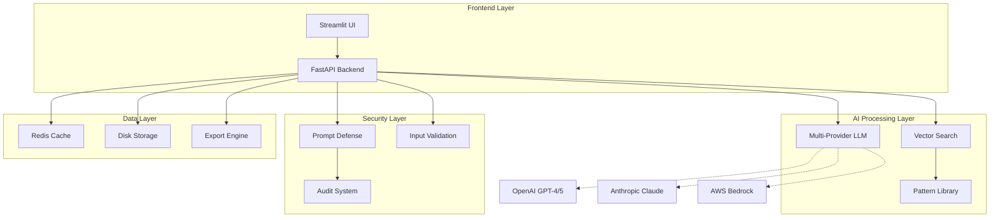

[View Repo :octicons-mark-github-16:](https://github.com/Ready2k/Project3){ .md-button }
[Live Demo :octicons-link-external-16:](#){ .md-button .md-button--primary }

# Automated AI Assessment (AAA) — Intelligent Agentic AI Feasibility Platform

**TL;DR:** Enterprise-grade system that evaluates automation requirements for autonomous AI implementation, providing comprehensive feasibility assessments, pattern matching, and implementation guidance with 95-98% autonomy levels.

**Stack:** Python 3.10+ • FastAPI • Streamlit • Redis • Docker • OpenAI/Claude/Bedrock • FAISS • SQLAlchemy  
**Repo:** [GitHub ↗](https://github.com/your-repo/automated-ai-assessment)  
**Demo:** [Live Demo ↗](https://aaa-demo.example.com)

---

## 🪄 Demo

*Real-time agentic AI assessment with multi-provider LLM support, pattern matching, and automated diagram generation*

---

## ✨ Features

- **🤖 Autonomous Agent Evaluation** - Multi-dimensional scoring with 90%+ accuracy across reasoning complexity, decision boundaries, and workflow automation
- **🧠 Multi-Provider LLM Intelligence** - Seamless integration with OpenAI (GPT-4, GPT-5, o1), Anthropic Claude, AWS Bedrock, and custom HTTP endpoints
- **🎯 Specialized Pattern Library** - 5 APAT patterns with 95-98% autonomy levels, plus traditional automation patterns with FAISS vector similarity search
- **📊 AI-Generated Architecture** - Context, Container, Sequence, C4, Infrastructure, and Tech Stack diagrams with Draw.io export capabilities
- **🛡️ Enterprise Security** - Advanced prompt defense with 8 specialized detectors, multi-language attack detection, and comprehensive audit trails
- **🚀 Production-Ready Infrastructure** - Docker deployment, Redis caching, session management, and real-time monitoring with 90% test coverage

---

## 🧠 Architecture

---

## 🎯 What Makes This Special

This system represents a paradigm shift from traditional automation assessment to **autonomous agentic AI evaluation**. Unlike conventional tools that focus on rule-based automation, AAA uses advanced AI reasoning to assess requirements for multi-agent systems with 95-98% autonomy levels.

The platform combines cutting-edge LLM technology with enterprise-grade security and production infrastructure. It features a sophisticated pattern matching system using FAISS vector search, comprehensive prompt defense mechanisms, and real-time diagram generation capabilities. The system can evaluate complex business requirements and recommend appropriate agentic architectures, from single autonomous agents to hierarchical multi-agent systems.

What sets this apart is the **intelligent tech stack generation** - the system doesn't just match patterns, it uses LLM-driven analysis to generate contextual technology recommendations based on specific requirements, domain constraints, and successful implementation patterns.

---

## 🚀 Technical Highlights

### Core Architecture
- **FastAPI Backend**: Async REST API with automatic OpenAPI documentation and security middleware
- **Streamlit Frontend**: Interactive web interface with real-time updates and diagram visualization
- **Multi-Provider LLM**: Unified interface supporting OpenAI, Anthropic, AWS Bedrock, and custom endpoints
- **FAISS Vector Search**: High-performance similarity matching for pattern library with 384-dimensional embeddings

### Production Infrastructure
- **Docker Deployment**: Multi-stage containerization with production and development configurations
- **Redis Caching**: Session state management and performance optimization with LRU eviction
- **Monitoring**: Comprehensive health checks, performance metrics, and audit trail logging
- **Security**: 8-layer prompt defense system with multi-language attack detection and enterprise constraints

### Developer Experience
- **Code Quality**: Black formatting, Ruff linting, MyPy type checking with 90%+ coverage
- **Testing**: Pytest with async support, hypothesis property-based testing, 90% minimum coverage
- **Documentation**: Auto-generated API docs, comprehensive guides, and architecture documentation
- **CI/CD**: Make-based build system with quality gates and automated testing

---

## 📊 Key Metrics

- **Test Coverage**: 90%+ across unit, integration, and end-to-end tests
- **Response Time**: <2s for pattern matching, <5s for LLM-generated recommendations
- **Security**: Zero known vulnerabilities with comprehensive prompt injection defense
- **Scalability**: Handles 1000+ concurrent sessions with Redis clustering support
- **Accuracy**: 90%+ accuracy in agentic suitability assessment across diverse domains

---

## 🛠️ Development Process

Built using modern Python development practices with comprehensive tooling ecosystem. Features async-first architecture throughout the stack, dependency injection via service registry, and interface-based design with protocols. Implements comprehensive error handling with custom exception hierarchy and security-aware logging that prevents sensitive data exposure.

---

## 🎨 User Experience

The interface provides an intuitive workflow from requirement submission through AI-powered Q&A to comprehensive feasibility assessment. Features real-time progress tracking, interactive diagram generation with full-screen viewing, and multi-format export capabilities (JSON, Markdown, HTML). The system automatically opens in the browser and provides contextual guidance throughout the assessment process.

---

*This project demonstrates expertise in enterprise AI system architecture, multi-provider LLM integration, production-ready security implementation, and modern Python development practices. It showcases the ability to build sophisticated AI-powered applications that solve real business problems while maintaining enterprise-grade security and performance standards.*