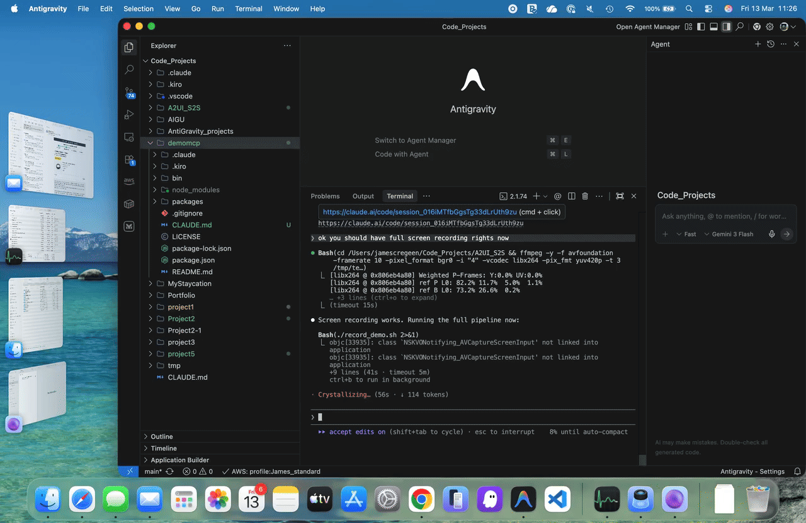
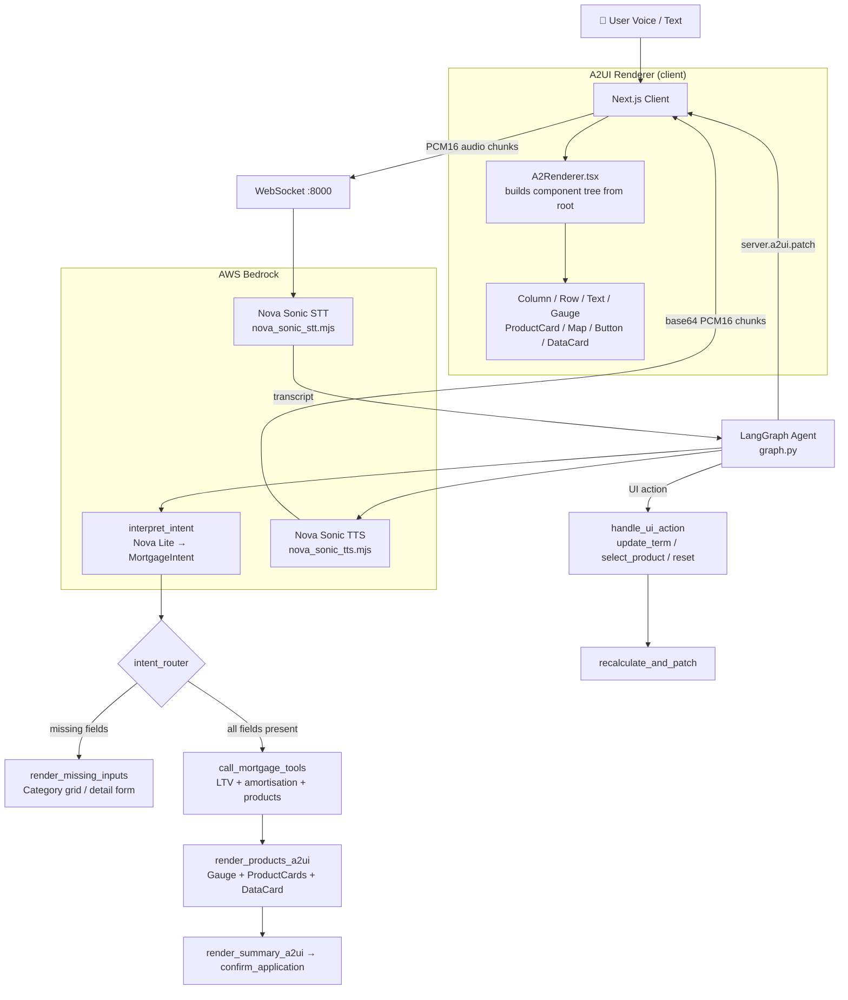

[View Repo :octicons-mark-github-16:](https://github.com/Ready2k/A2UI_S2S){ .md-button }
[Live Demo :octicons-link-external-16:](#){ .md-button .md-button--primary }

# A2UI Mortgage Assistant — Voice-First AI with Dynamic UI Generation

**TL;DR:** A voice-first mortgage assistant where the AI doesn't just talk — it builds the UI in real time. Speak your requirements; a LangGraph agent interprets them and assembles an interactive interface (product comparison cards, gauges, maps, timelines) on the fly via a custom A2UI protocol.

**Stack:** Python • FastAPI • LangGraph • Amazon Nova Sonic • Next.js 16 • React 19 • TypeScript • Tailwind CSS • AWS Bedrock • WebSocket

---

## 🎬 Demo

<video autoplay loop muted playsinline controls poster="../../assets/demos/pr6-mortgage/poster.jpg" style="border-radius:12px;box-shadow:0 2px 8px rgba(0,0,0,.15);max-width:100%;">
  <source src="../../assets/demos/pr6-mortgage/demo.mp4" type="video/mp4">
  
</video>

⚙️ Live system walkthrough

---

## ✨ Features

- **🎙️ Voice-First Interaction** - Amazon Nova Sonic handles both STT and TTS; the user never touches a form
- **🧩 Agent-Generated UI (A2UI)** - A LangGraph agent emits a component tree at runtime; the client renders it dynamically with no hardcoded screens
- **🗺️ Property Insights** - Address lookup with an embedded Leaflet map and green mortgage reward when a property is identified
- **📊 Live Product Comparison** - Gauge, ProductCard, DataCard, and ComparisonBadge components assembled and patched by the agent
- **🤝 Trouble Detection** - Counts unhelpful turns and surfaces a "Speak to a Colleague" button after two consecutive dead-ends
- **🛡️ Guardrail Enforcement** - Nova Lite checks every response for off-topic content and substitutes a safe fallback
- **🧪 Goal-Based Test Suite** - WebSocket integration tests validate full conversation scenarios end-to-end

---

## 🧠 Architecture

---

## 🎯 What Makes This Special

### Agent-Driven UI — No Hardcoded Screens
Most voice assistants return text. This one returns a **component tree**. The LangGraph agent emits `server.a2ui.patch` messages containing a flat list of typed components with parent–child references. `A2Renderer.tsx` builds the tree at runtime and renders it. Add a new component type on the server; the client renders it automatically. Remove a screen; the agent simply stops emitting it.

### Single Outbox, Coordinated Delivery
The agent queues all output — UI patches, voice lines, transcripts — into a `state.outbox`. `process_outbox()` always flushes non-voice events first, then batches all speech into a single TTS call. This prevents audio from playing before the UI has updated.

### Trouble-Aware Conversation
The agent tracks `trouble_count`: how many turns the user gave no useful information or used struggle keywords. At ≥ 2, `show_support` flips to `true` and the frontend surfaces a human escalation button — all without any client-side logic changes.

---

## 🚀 Technical Highlights

### LangGraph State Machine
- **Nodes**: `ingest_input`, `interpret_intent`, `render_missing_inputs`, `call_mortgage_tools`, `render_products_a2ui`, `handle_ui_action`, `recalculate_and_patch`, `render_summary_a2ui`, `confirm_application`, `clear_pending_action`
- **State**: Single `AgentState` object as source of truth — `intent`, `ltv`, `products`, `selection`, `ui`, `outbox`, `trouble_count`
- **Routing**: `start_router` dispatches on message type (transcript vs UI action); `intent_router` branches on field completeness

### Amazon Nova Sonic Integration
- **STT**: Node.js subprocess (`nova_sonic_stt.mjs`) receiving PCM16 via stdin, emitting `TRANSCRIPT:` lines on stdout
- **TTS**: Separate Node.js subprocess (`nova_sonic_tts.mjs`) emitting `AUDIO_CHUNK:<base64>` lines, forwarded as WebSocket binary frames
- **Fallback**: Keyword-based intent extraction when AWS is unavailable

### Client Audio Pipeline
- `AudioWorkletNode` (`PCM16Processor`) records at 16 kHz; chunks base64-encoded to server
- VAD: auto-stops after 1500 ms silence below 0.015 RMS
- `AudioStreamer` queues base64 PCM16 chunks on a 24 kHz `AudioContext`; mic auto-restarts after TTS playback ends

### A2UI Component Library
Supported types: `Column`, `Row`, `Text` (h1/h2/h3/body), `Gauge`, `ProductCard`, `Button`, `Map` (Leaflet iframe), `Timeline`, `DataCard`, `BenefitCard`, `ComparisonBadge`, `Image`. Unknown types render as a visible error box — no silent failures.

---

## 📊 Key Metrics

- **Latency**: STT → agent response → TTS in a single WebSocket round-trip
- **Test coverage**: Goal-based integration tests for full conversation scenarios (e.g. `GBT-FTB-01` first-time buyer flow)
- **UI components**: 13 dynamic component types, zero hardcoded screens
- **Models used**: Amazon Nova Sonic (voice), Amazon Nova Lite (intent/guardrails), Claude Sonnet/Haiku (A2UI design)

---

*This project demonstrates event-driven agent architecture, voice AI integration at the protocol level, and a novel approach to AI-generated interfaces where the model controls both conversation flow and UI state.*
