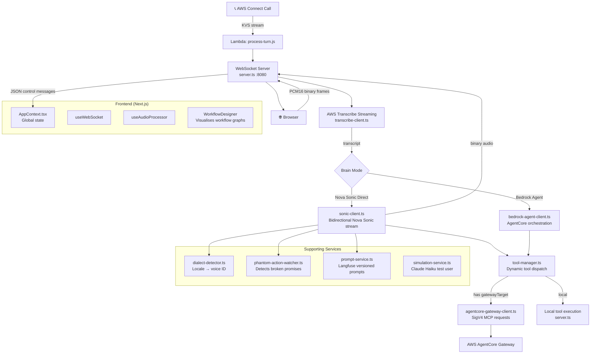

[View Repo :octicons-mark-github-16:](https://github.com/Ready2k/Voice_S2S){ .md-button }
[Live Demo :octicons-link-external-16:](#){ .md-button .md-button--primary }

# Voice S2S Platform — Production-Grade Speech-to-Speech AI

**TL;DR:** A full-duplex speech-to-speech platform built on Amazon Nova Sonic with two selectable AI brain modes, a JSON-driven tool system routable through AWS AgentCore, automatic dialect detection with mid-conversation voice switching, and a phantom action watcher that catches LLMs when they promise but don't deliver.

**Stack:** Node.js • TypeScript • Amazon Nova Sonic • AWS Bedrock • Next.js 15 • WebSocket • AWS Connect • Langfuse

---

## ✨ Features

- **🔊 Full-Duplex Voice** - PCM16 audio streams in both directions on a single WebSocket; mic captures at 16 kHz, playback at 24 kHz
- **🧠 Dual Brain Modes** - Nova Sonic Direct (~200–500 ms) for low-latency interactions; Bedrock Agent (~1–3 s) for multi-step orchestrated reasoning
- **🛠️ JSON-Driven Tools** - Drop a JSON file into `/tools/` to expose a new capability; no code changes required
- **🌍 Dialect Detection & Voice Switching** - AWS Transcribe identifies language mid-conversation; the system generates a natural transition phrase and switches voice automatically
- **👻 Phantom Action Watcher** - Detects when the LLM verbally commits to an action (balance check, dispute filing, transaction lookup) but skips the tool call, then reprompts silently
- **📋 Workflow Graphs** - JSON-defined conversation state machines injected into system prompts and visualised in the frontend WorkflowDesigner
- **📞 AWS Connect Integration** - Lambda functions bridge Amazon Connect telephony calls into the same Nova Sonic pipeline via Kinesis Video Streams
- **🧪 Simulated E2E Testing** - Claude Haiku auto-generates user-role messages for scripted conversation tests; outcomes persisted as JSON

---

## 🧠 Architecture

---

## 🎯 What Makes This Special

### Phantom Action Watcher
LLMs frequently say "I'll check your balance now" and then return a text response instead of calling the tool. `phantom-action-watcher.ts` monitors every turn for high-confidence verbal commitments (balance check, transaction lookup, dispute filing) and, if no corresponding tool call appears in the same response, issues a silent reprompt. Users never see the failure; the model self-corrects.

### Dual Brain, One Interface
The same frontend, same WebSocket protocol, and same tool definitions work across both brain modes. Nova Sonic Direct runs tools natively within the model stream for minimal latency. Bedrock Agent mode hands off to AWS AgentCore for complex multi-step reasoning. Switching modes is a runtime setting — no redeployment.

### Tool System as Configuration
Every tool is a JSON file: `name`, `description`, `input_schema`, `instruction`, `category`, optional `gatewayTarget`. Setting `gatewayTarget` routes the call through `AgentCoreGatewayClient` using AWS SigV4-signed MCP requests. Tools without `gatewayTarget` run locally. Adding a capability is dropping a file — no TypeScript changes.

### Dialect-Aware Conversations
AWS Transcribe Streaming returns language identification confidence scores alongside transcripts. `dialect-detector.ts` maps locale codes (`en-GB`, `fr-FR`, etc.) to voice IDs. When confidence crosses a threshold, `transition-handler.ts` calls Bedrock to generate a natural "let me switch to your language" phrase, then swaps the active voice mid-session.

---

## 🚀 Technical Highlights

### Backend (Node.js + TypeScript)
- **WebSocket server** (`server.ts`): single entry point handling session lifecycle, binary audio frames, and JSON control messages on one connection
- **Nova Sonic** (`sonic-client.ts`): bidirectional stream; system prompt assembled at startup from modular `.txt` files in `backend/prompts/`
- **Prompt composition**: `core-system_default.txt` + `core-guardrails.txt` + `core-tool_access_assistant.txt` + persona file + silently injected dialect detection prompt
- **Langfuse integration**: `prompt-service.ts` fetches production-labelled prompt versions at runtime — update prompts without redeploying

### Frontend (Next.js 15)
- Static export served directly from the backend in production (`output: 'export'`)
- **`AppContext.tsx`**: central state for session, transcripts, tool events, token usage, and workflow step tracking
- **`WorkflowDesigner`**: visualises embedded JSON workflow graphs (`workflow-banking.json`, `workflow-disputes.json`, etc.)
- Credentials can be set at runtime via the Settings panel (stored in `sessionStorage`)

### AWS Infrastructure
- **Amazon Connect**: `start-session.js` Lambda creates a DynamoDB record on call arrival; `process-turn.js` Lambda processes each KVS turn
- **CloudFormation**: `aws/cloudformation.yaml` + `aws/banking-data-layer.yaml` define supporting infrastructure
- **Simulated testing**: `simulation-service.ts` uses Claude Haiku on Bedrock to generate realistic user turns; results persisted to `tests/test_logs/`

---

## 📊 Key Metrics

- **Latency**: ~200–500 ms (Nova Sonic Direct), ~1–3 s (Bedrock Agent)
- **Tool loading**: dynamic at startup — zero-downtime capability additions
- **Test coverage**: scripted E2E conversations with pass/fail/unknown outcomes logged as JSON
- **Deployment**: single `npm start` serves both frontend and backend from port 8080

---

*This project demonstrates production-level voice AI engineering: real-time audio pipelines, multi-modal AWS service orchestration, self-healing LLM behaviour, and a configuration-driven architecture that scales without code changes.*
