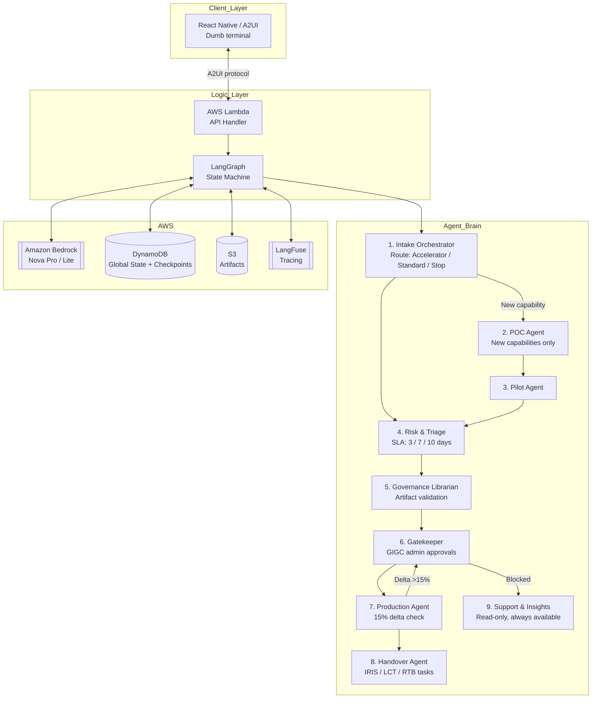

[View Repo :octicons-mark-github-16:](https://github.com/Ready2k/AIGU){ .md-button }
[Live Demo :octicons-link-external-16:](#){ .md-button .md-button--primary }

# AI Governance Unit (AIGU) — Continuous AI Governance Orchestration

**TL;DR:** A 9-agent LangGraph system that replaces manual AI governance checklists with a continuous orchestration loop. Projects flow through a structured lifecycle — Intake → Risk → POC → Pilot → Librarian → Gatekeeper → Production → Handover — with specialized Amazon Nova agents handling each stage, automatic delta detection, and a universal support overlay at every step.

**Stack:** Python • LangGraph • Amazon Nova (Pro/Lite) • AWS Bedrock • AWS Lambda • DynamoDB • S3 • React Native • Expo • LangFuse

---

## ✨ Features

- **🧠 9-Agent Brain** - Each lifecycle stage has a dedicated agent with focused responsibilities; no monolithic prompt
- **⚡ Dual Paths** - Hero capabilities fast-track through an Accelerator path (skip POC); New capabilities follow the full Standard path with CAF approval
- **📊 15% Delta Threshold** - Production changes are auto-analysed; updates exceeding 15% trigger full GIGC re-approval automatically
- **🔄 State-Loop Architecture** - React Native frontend is a "dumb" terminal; all state lives in DynamoDB, managed by LangGraph
- **🛡️ Universal Support Overlay** - A read-only Support & Insights agent is available at every stage for status queries and "why" explanations
- **📋 Artifact Management** - Governance Librarian validates required artifacts by risk level and prevents duplication via automated audits
- **🔍 LangFuse Tracing** - Full prompt management and observability across all agent invocations
- **🧪 TDD Lifecycle Simulations** - Pytest-driven end-to-end lifecycle tests covering all paths and edge cases

---

## 🧠 Architecture

---

## 🎯 What Makes This Special

### Governance as a State Machine, Not a Spreadsheet
Traditional AI governance is checklists, email chains, and manual sign-offs. AIGU models the entire lifecycle as a LangGraph state machine. Every transition — approval, rejection, delta re-review — is a graph edge. Stage-specific agents run in sequence; the Support agent is always available as a side channel. The governance process becomes auditable, automatable, and queryable.

### Delta-Driven Re-Approval
When a production AI system changes, most governance processes require a full manual re-review by default. AIGU's Production agent computes the delta between the current and prior submission. Changes under 15% proceed without re-approval; changes over 15% automatically re-route through the Gatekeeper. The threshold is configurable and the logic is transparent.

### Hero vs. New Paths
Not all AI capabilities need the same scrutiny. "Hero" capabilities (proven patterns within existing guardrails) skip the POC stage entirely and fast-track to Pilot. "New" capabilities follow the full Standard path including CAF approval. The Intake agent classifies the path from the initial submission; humans only intervene at defined gates.

---

## 🚀 Technical Highlights

### LangGraph Orchestration
- **State machine**: `aigu/graph.py` — a compiled LangGraph graph with conditional edges for path routing
- **State persistence**: DynamoDB-backed LangGraph checkpoints for resumable sessions
- **Agent dispatch**: each agent in `aigu/agents/` receives the full state, acts on its slice, and returns a patch

### Amazon Nova via Bedrock
- **Nova Pro**: used for high-stakes decisions (risk classification, gatekeeper review, production delta analysis)
- **Nova Lite**: used for lower-stakes parsing (intake extraction, librarian checks, support queries)
- **LangFuse**: all prompts versioned and served at runtime; traces every invocation for debugging

### Frontend (React Native / A2UI)
- Pure state-renderer: the UI has no business logic; it renders whichever A2UI component tree the Lambda returns
- `expo start --web` for browser preview during development

### Deployment
- `./aigu_manager.sh deploy` — full stack via CloudFormation (Lambda + DynamoDB + S3 + IAM)
- `./aigu_manager.sh teardown` — clean removal of all AWS resources
- `pytest tests/simulate_full_lifecycle.py` — end-to-end lifecycle simulation (no AWS required for unit stages)

---

## 📊 Key Metrics

- **Agents**: 9 specialised agents covering the full AI project lifecycle
- **Lifecycle stages**: 8 stages (Intake → Handover), 2 paths (Accelerator / Standard)
- **Delta threshold**: configurable, default 15% — triggers automatic GIGC re-approval
- **SLA options**: 3 / 7 / 10 days, risk-based assignment by Risk & Triage agent

---

*This project demonstrates multi-agent orchestration for a real enterprise problem domain: replacing fragmented governance checklists with a continuous, auditable, agent-driven workflow.*
