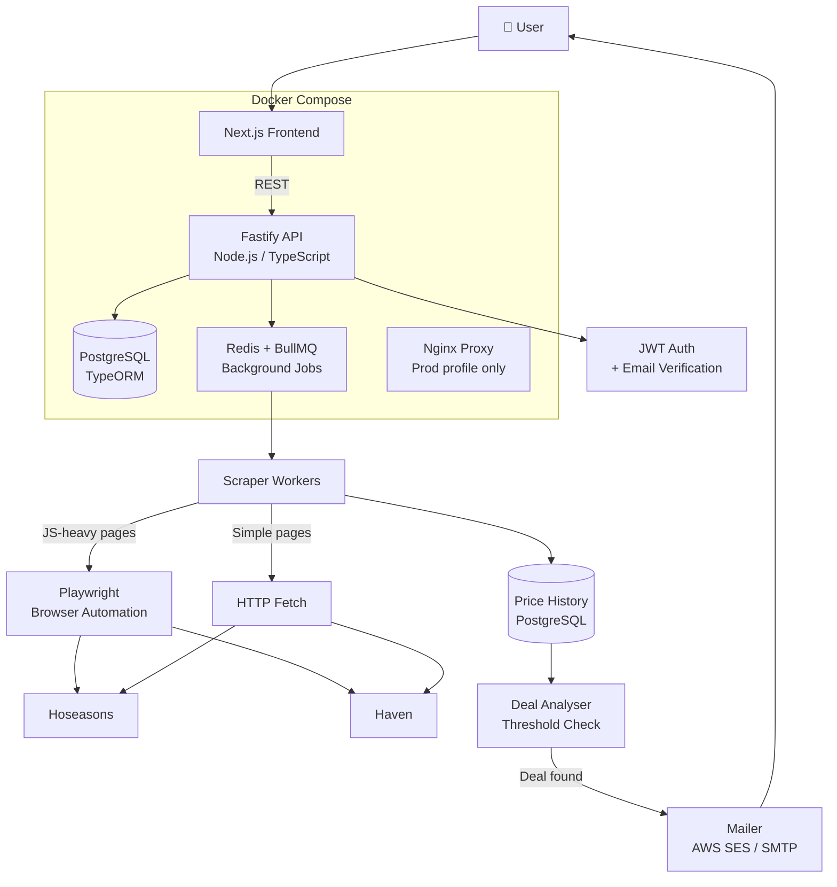

[View Repo :octicons-mark-github-16:](https://github.com/Ready2k/MyStaycation){ .md-button }
[Live Demo :octicons-link-external-16:](#){ .md-button .md-button--primary }

# MyStaycation — UK Holiday Price Watcher

**TL;DR:** A personal price-monitoring assistant for UK staycations (Hoseasons and Haven). It builds a price history over time, compares current prices against that history, and emails you only when a booking is genuinely worth acting on — not just because a price changed.

**Stack:** Node.js • TypeScript • Fastify • PostgreSQL • TypeORM • Redis • BullMQ • Next.js • Playwright • Docker Compose • AWS SES • Nginx

---

## ✨ Features

- **📈 Historical Price Tracking** - Stores price snapshots over time to establish a real baseline; alerts are anchored to history, not absolute price
- **🎯 Smart Alert Thresholds** - Configurable conditions for what counts as a meaningful deal; avoids noise from minor fluctuations
- **🌐 Browser-Based Scraping** - Playwright handles providers that require JavaScript rendering (Hoseasons, Haven)
- **⚙️ Kill Switches** - Per-provider and global scraping toggles via environment variables; no code changes needed to pause a provider
- **📧 Email Notifications** - AWS SES integration with fallback to SMTP; email verification required before alerts are sent
- **🔐 Secure Authentication** - JWT with email verification and password reset; bcrypt password hashing
- **🐳 Dev + Prod Profiles** - Single Docker Compose file with separate `dev` and `prod` profiles; Nginx proxy in production

---

## 🧠 Architecture

---

## 🎯 What Makes This Special

### History-Anchored Alerts
Most price trackers alert on any drop. This one builds a historical baseline per holiday and only alerts when a price is meaningfully below what it's typically been — accounting for seasonal patterns. You get notified when a deal is actually unusual, not just when a provider tweaks a price by £5.

### Kill Switches Without Deployments
Providers change their sites without warning. Rather than requiring a code fix and redeployment to pause a broken scraper, the system reads environment variables at job dispatch time. `PROVIDER_HOSEASONS_ENABLED=false` stops Hoseasons jobs immediately. `SCRAPING_ENABLED=false` stops everything. No restarts required.

### Respectful Scraping
- Runs at 24–72 hour intervals to avoid hammering providers
- Identifies itself with descriptive User-Agent headers
- Respects `robots.txt`
- Full audit log of every fetch operation

---

## 🚀 Technical Highlights

### Backend (Fastify + TypeScript)
- **Queue architecture**: Redis + BullMQ handles all scraping as background jobs with retry logic and concurrency controls
- **TypeORM**: entity-based schema management with migrations; PostgreSQL for all persistent data
- **Playwright concurrency**: `PLAYWRIGHT_CONCURRENCY` env var caps browser instances to manage memory in constrained environments

### Frontend (Next.js)
- Responsive design — accessible on mobile for on-the-go deal checking
- Holiday profile management: set preferences once, monitor continuously

### Infrastructure
- **Dev profile**: direct port exposure (`:3000` frontend, `:4000` API), no Nginx
- **Prod profile**: Nginx reverse proxy with rate limiting and security headers
- `docker-compose exec api npm run seed` to populate initial provider and configuration data
- AWS SES for production email; console log fallback for local development

---

## 📊 Key Metrics

- **Providers**: Hoseasons, Haven (extensible via provider guide in `docs/development/PROVIDER_GUIDE.md`)
- **Scrape interval**: 24–72 hours (configurable per provider)
- **Alert logic**: threshold-based against historical price baseline
- **Auth**: JWT + bcrypt + email verification + password reset

---

*A practical full-stack project solving a real personal need: monitoring holiday prices intelligently so you only have to act when it actually matters.*
