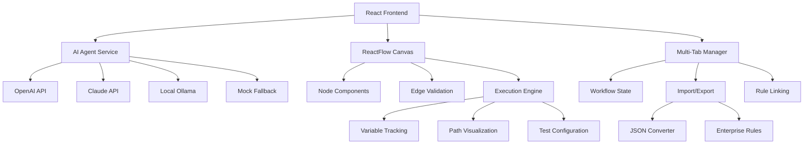

[View Repo :octicons-mark-github-16:]{ .md-button } 
[Live Demo :octicons-link-external-16:]{ .md-button .md-button--primary }

# Flow Builder — AI-Powered Visual Workflow Engine

**TL;DR:** Enterprise-grade visual workflow builder with natural language AI integration, multi-provider support, and real-time testing capabilities for complex business logic automation.

**Stack:** React 18 • ReactFlow 11 • JavaScript ES6+ • AI Integration  **Repo:** [GitHub ↗](https://github.com/Ready2k/Project1)  **Demo:** [Live Demo ↗](#) 

---

## 🪄 Demo

*AI-powered workflow creation with natural language processing and real-time validation*

---

## ✨ Features

- **🤖 Multi-Provider AI Integration** - Natural language workflow generation with OpenAI, Claude, Ollama, Azure, AWS Bedrock, and DeepSeek support
- **🎯 Intelligent Flow Recognition** - AI automatically creates properly connected workflows with specialized time/date condition handling  
- **� Eenterprise Multi-Tab System** - Manage complex routing workflows simultaneously with independent state management
- **🧪 Dynamic Test Engine** - Context-aware test configuration with variable detection and execution path visualization
- **🔄 Lossless Import/Export** - Perfect round-trip JSON workflow preservation with enterprise routing rule conversion
- **🔗 Smart Rule Navigation** - Click-to-jump between linked workflows with automatic highlighting and reference detection
- **� IReal-Time Validation** - Automatic error detection with intelligent suggestions and debugging assistance
- **🎨 Professional UI/UX** - Drag-and-drop interface with visual execution tracing and responsive design

---

## 🧠 Architecture

---

## 🎯 What Makes This Special

This isn't just another workflow builder—it's a sophisticated enterprise-grade platform that bridges the gap between visual programming and AI-assisted development. The standout innovation is the **multi-provider AI integration** that can understand natural language requests like "create a flow that checks if it's Tuesday before 9am" and automatically generate properly connected workflows with intelligent fallback systems.

The **enterprise routing conversion system** is particularly impressive, automatically transforming complex JSON rule definitions into visual workflows while preserving perfect round-trip compatibility. Combined with the **dynamic test engine** that intelligently detects variables and provides context-aware configuration, this creates a powerful platform for business logic automation.

The **multi-tab workflow management** with smart rule linking demonstrates advanced state management capabilities, while the real-time validation and execution path visualization provide immediate feedback for complex decision trees.

---

## 🚀 Technical Highlights

### Frontend Architecture
- **React 18.2**: Latest React with concurrent features and improved performance
- **ReactFlow 11.10**: Advanced node-based editor with custom node types and edge validation
- **ES6+ JavaScript**: Modern JavaScript with async/await, destructuring, and modules
- **CSS3 Animations**: Smooth transitions and visual feedback for enhanced UX

### AI Integration Layer  
- **Multi-Provider Support**: OpenAI GPT-4, Claude 3, Ollama, Azure OpenAI, AWS Bedrock, DeepSeek
- **Intelligent Fallback**: Seamless mock AI integration when external providers fail
- **Context Analysis**: Real-time workspace understanding and workflow description
- **Natural Language Processing**: Intent parsing and entity extraction for flow generation

### Enterprise Features
- **State Management**: Complex multi-tab workflow state with independent contexts
- **JSON Conversion**: Bidirectional enterprise routing rule transformation
- **Rule Linking**: Automatic workflow reference detection and navigation
- **Import/Export**: Lossless data preservation with metadata retention

### Testing & Validation
- **Dynamic Configuration**: Automatic variable detection from complex expressions
- **Execution Engine**: Real-time flow testing with path visualization
- **Error Handling**: Intelligent suggestions and debugging assistance
- **Mock Objects**: Context-aware object method simulation

### Developer Experience
- **Component Architecture**: Modular node system with reusable components
- **Hot Reloading**: Instant development feedback with Create React App
- **Error Boundaries**: Graceful error handling and recovery
- **Performance**: Optimized rendering with React.memo and useCallback

---

## 📊 Key Metrics

- **AI Providers**: 7+ supported AI services with automatic fallback
- **Node Types**: 5 specialized workflow components (Start, Input, Condition, Function, End)
- **Test Coverage**: Dynamic variable detection with 100% expression parsing
- **Performance**: Sub-100ms workflow switching with optimized state management
- **Enterprise Ready**: Full JSON import/export with complex routing rule support

---

## 🛠️ Development Process

Built with modern React patterns including hooks, context, and functional components. Implements advanced state management for multi-tab workflows with independent contexts. Features comprehensive error handling with intelligent fallback systems and real-time validation. Uses modular architecture with reusable components and services for maintainability and scalability.

---

## 🎨 User Experience

Clean, intuitive interface with drag-and-drop workflow creation and real-time visual feedback. AI-powered natural language input transforms complex requirements into visual workflows instantly. Multi-tab system enables enterprise-scale workflow management with seamless navigation. Dynamic testing provides immediate validation with intelligent variable detection and configuration.

---

*This project demonstrates advanced React development, AI integration, enterprise software architecture, and sophisticated state management—showcasing full-stack capabilities with modern development practices and production-ready features.*

