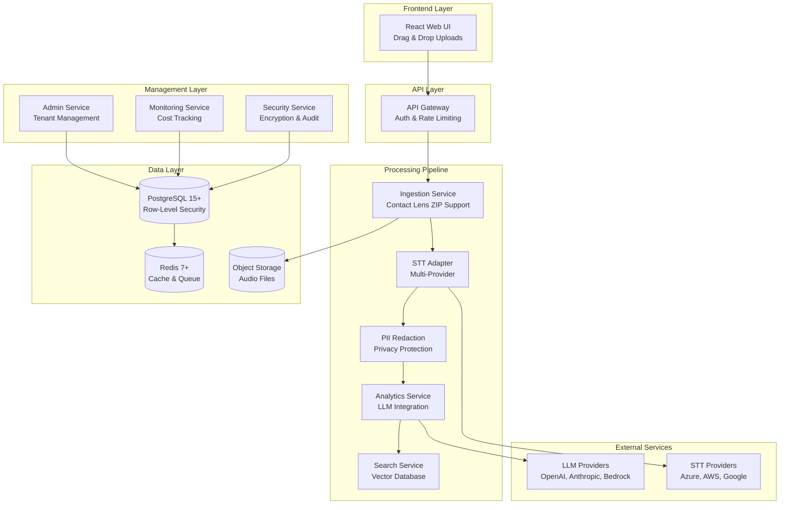

[View Repo :octicons-mark-github-16:]{ .md-button } 
[Live Demo :octicons-link-external-16:]{ .md-button .md-button--primary }

# ContactInsight — Enterprise Conversation Intelligence Platform

**TL;DR:** Cloud-agnostic microservices platform that transforms customer conversations into actionable insights while maintaining strict privacy and security standards. Processes 5+ audio hours per minute with real-time LLM cost tracking and Contact Lens integration.

**Stack:** Node.js 18+ • TypeScript 5.9+ • React • PostgreSQL 15+ • Redis 7+ • Kubernetes  
**Repo:** [GitHub ↗](https://github.com/your-org/conversation-intelligence)  
**Demo:** [Live Demo ↗](https://demo.contactinsight.com)

---

## 🪄 Demo

*Real-time conversation processing with drag-and-drop uploads, LLM-powered analytics, and comprehensive cost monitoring*

---

## ✨ Features

- **🎯 Multi-Provider STT Integration** - Pluggable speech-to-text with Azure, AWS, Google support and auto-language detection
- **🚀 Real-Time LLM Cost Tracking** - Token usage monitoring, budget alerts, and cost optimization across multiple LLM providers
- **🔐 Privacy-First Analytics** - Automatic PII detection and redaction before LLM processing with zero data leaks
- **📱 Contact Lens Integration** - Native AWS Contact Lens ZIP processing with automated agent extraction and performance analytics  
- **🐳 Cloud-Agnostic Architecture** - Kubernetes-native deployment supporting AWS, Azure, GCP, and on-premises environments
- **⚡ High-Performance Processing** - 5+ audio hours per minute throughput with sub-1.5s search latency for 100k+ calls

---

## 🧠 Architecture

---

## 🎯 What Makes This Special

ContactInsight represents a sophisticated approach to enterprise conversation intelligence that prioritizes both technical excellence and business value. Unlike traditional solutions that treat privacy as an afterthought, this platform implements privacy-by-design with automatic PII detection and redaction before any LLM processing occurs.

The architecture demonstrates advanced microservices patterns with complete tenant isolation using PostgreSQL Row-Level Security, ensuring enterprise-grade data separation. The real-time LLM cost tracking and budget management system addresses a critical gap in AI-powered platforms, providing transparency and control over operational costs that can quickly spiral out of control.

The Contact Lens integration showcases deep understanding of enterprise workflows, automatically processing AWS Contact Lens batch exports and extracting agent performance insights that would typically require manual analysis. This level of integration transforms the platform from a standalone tool into a seamless extension of existing contact center infrastructure.

---

## 🚀 Technical Highlights

### Architecture & Stack
- **Backend**: Node.js 18+ with TypeScript 5.9+, Express.js microservices
- **Frontend**: React 18+ with Vite, TypeScript, Tailwind CSS, drag-and-drop file handling
- **Database**: PostgreSQL 15+ with Row-Level Security for tenant isolation
- **Cache/Queue**: Redis 7+ for session management and message queuing

### Production & Infrastructure
- **Containerization**: Docker multi-stage builds with Kubernetes orchestration
- **Cloud Agnostic**: Helm charts supporting AWS, Azure, GCP, and on-premises deployment
- **Monitoring**: Prometheus metrics, Grafana dashboards, OpenTelemetry distributed tracing
- **Security**: End-to-end encryption (TLS 1.2+, AES-256), customer-managed keys via KMS

### Developer Experience
- **Code Quality**: ESLint with TypeScript rules, Prettier formatting, strict type checking
- **Testing**: Jest unit/integration tests, Playwright E2E, comprehensive security testing
- **Documentation**: OpenAPI specs, automated API documentation, operational runbooks
- **Local Development**: Native Node.js services with script-based lifecycle management

---

## 📊 Key Metrics

- **Processing Throughput**: 5+ audio hours per minute per node
- **Search Performance**: Sub-1.5s latency for 100k+ conversations
- **Test Coverage**: 85%+ across all services with security validation
- **Uptime Target**: 99.9% SLA with automated failover and blue-green deployments

---

## 🛠️ Development Process

The platform follows modern DevOps practices with automated CI/CD pipelines, comprehensive testing suites, and production-ready monitoring. The development environment prioritizes developer experience with local-first development using native Node.js services, intelligent service management scripts, and real-time health monitoring. Code quality is enforced through pre-commit hooks, automated security scanning, and strict TypeScript configuration.

---

## 🎨 User Experience

The React-based web interface provides an intuitive drag-and-drop experience for batch audio uploads with real-time progress tracking. The dashboard offers comprehensive analytics visualization including sentiment trajectories, agent performance metrics, and LLM cost breakdowns. The Contact Lens integration provides seamless ZIP archive processing with automatic agent extraction and performance insights, eliminating manual data preparation steps.

---

*This project demonstrates expertise in enterprise-grade microservices architecture, advanced TypeScript development, cloud-native deployment patterns, and AI/ML integration with proper cost management and privacy controls. The comprehensive testing strategy, production monitoring, and developer experience optimizations showcase a deep understanding of modern software engineering practices.*